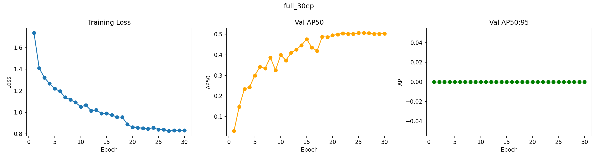
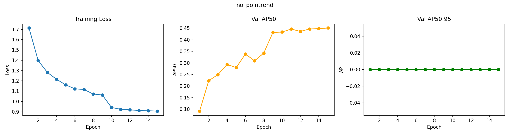

# NYCU Computer Vision 2026 HW3

- **Student ID**: 314552047
- **Name**: Tsai,Sung-Hao

---

## Introduction

This repository implements a cell instance segmentation model for NYCU Computer Vision HW3. The task is to detect and segment four types of cells (class1, class2, class3, class4) from colored medical microscopy images, evaluated by AP50.

Our approach is based on **Mask R-CNN** (He et al., CVPR 2017) with the following key designs:

- **Backbone**: ResNet-50 with FPN, pretrained on ImageNet
- **Cell-optimized anchors**: smaller anchor sizes (8–128px) for small cell detection
- **Strong augmentation**: random flip, 90° rotation, color jitter to handle staining variation
- **Cosine LR schedule with warmup**: better convergence on small datasets (209 images)
- **Test Time Augmentation (TTA)**: 4-flip ensemble with NMS at inference
- **Additional experiment**: PointRend mask head (Kirillov et al., CVPR 2020)

---

## Environment Setup

**Requirements**: Python 3.11, CUDA 11.8+

```bash
# Create conda environment
conda create -n hw3 python=3.11
conda activate hw3

# Install PyTorch (CUDA 11.8)
pip install torch torchvision torchaudio --index-url https://download.pytorch.org/whl/cu118

# Install other dependencies
pip install pycocotools scikit-image tifffile matplotlib
```

Or install all at once:

```bash
pip install -r requirements.txt
```

**`requirements.txt`**:
```
torch>=2.0.0
torchvision>=0.15.0
pycocotools
scikit-image
tifffile
matplotlib
```

---

## Usage

### Training

```bash
PYTORCH_CUDA_ALLOC_CONF=expandable_segments:True \
python train.py --mode train \
    --train_dir ./train \
    --output_dir ./output \
    --gpu_ids 0 \
    --epochs 30 \
    --batch_size 1 \
    --val_every 1
```

Key arguments:

| Argument | Default | Description |
|---|---|---|
| `--train_dir` | `./train` | Training images directory |
| `--output_dir` | `./output` | Directory to save checkpoints and curves |
| `--gpu_ids` | all | GPU(s) to use, e.g. `--gpu_ids 0` or `--gpu_ids 0 1` |
| `--epochs` | 30 | Number of training epochs |
| `--batch_size` | 1 | Batch size |
| `--val_every` | 1 | Run validation every N epochs |
| `--lr` | 5e-4 | Learning rate |

### Inference

```bash
PYTORCH_CUDA_ALLOC_CONF=expandable_segments:True \
python train.py --mode predict \
    --test_dir ./test \
    --id_json ./test_image_name_to_ids.json \
    --output_dir ./output \
    --gpu_ids 0 \
    --checkpoint ./output/best_model_ap50.pth
```

The submission file will be saved to `./output/test-results.json` in COCO format.

Key arguments:

| Argument | Default | Description |
|---|---|---|
| `--test_dir` | `./test` | Test images directory |
| `--id_json` | `./test_image_name_to_ids.json` | Filename to image_id mapping |
| `--checkpoint` | auto | Path to `.pth` checkpoint (auto-selects best if not specified) |
| `--score_thresh` | 0.5 | Minimum confidence score |
| `--no_tta` | — | Disable Test Time Augmentation |

### Ablation Study

To reproduce ablation experiments:

```bash
# Run all 8 ablation experiments (GPU 1, 30 epochs each)
bash run_ablation_v2.sh 1 30

# Or run a single experiment
PYTORCH_CUDA_ALLOC_CONF=expandable_segments:True \
python ablation_v2.py \
    --exp_name my_experiment \
    --train_dir ./train \
    --output_dir ./ablation_v2 \
    --gpu_ids 0 \
    --epochs 30
```

Results are logged to `ablation_v2_results.csv` and curves saved to `ablation_v2/{exp_name}/curves.png`.

---

## Performance Snapshot

> Insert a screenshot of the leaderboard here.

**Validation AP50**: 0.5410 (ResNet-50 baseline, 30 epochs)

| Model | Val AP50 | Epochs |
|---|---|---|
| ResNet-50 baseline | 0.5410 | 30 |
| + PointRend | 0.5062 | 30 |

### Training & Validation Curves

**Full model with PointRend (30 epochs)**



**Baseline without PointRend (15 epochs)**



---

## File Structure

```
hw3/
├── train.py                  # Main training & inference script
├── ablation_v2.py            # Ablation study script
├── run_ablation_v2.sh        # Shell script to run all ablations
├── requirements.txt
├── train/                    # Training images (not included)
│   └── [image_name]/
│       ├── image.tif
│       ├── class1.tif
│       └── ...
├── test/                     # Test images (not included)
│   └── [image_name].tif
├── test_image_name_to_ids.json
└── output/
    ├── best_model.pth
    ├── best_model_ap50.pth
    ├── training_curves.png
    └── test-results.json     # Submission file
```

---

## References

1. He, K., et al. (2017). Mask R-CNN. *ICCV*.
2. Kirillov, A., et al. (2020). PointRend: Image Segmentation as Rendering. *CVPR*.
3. Lin, T. Y., et al. (2017). Feature Pyramid Networks for Object Detection. *CVPR*.
4. Loshchilov, I., & Hutter, F. (2019). Decoupled Weight Decay Regularization. *ICLR*.
5. Moshkov, N., et al. (2020). Test-time augmentation for deep learning-based cell segmentation. *Scientific Reports*.
